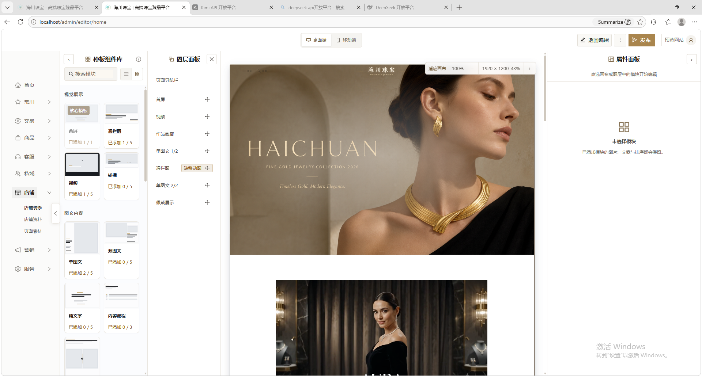

# 店铺装修编辑器体验审计

日期：2026-08-20

> 后续约束更新：用户已明确模板组件库、图层面板、中央画布、属性面板四个功能区域必须保留。本文中“合并左侧面板”“空属性面板自动收起”等建议不再采用；修订后的权威方案见 [revised-plan.md](./revised-plan.md)。

## 审计范围

本次只评估店铺装修编辑器的桌面端工作台：全局导航、模板库、图层、画布、属性面板和顶部页面操作。依据是用户当次提供的 3 张截图与当前相关组件结构。

不评估公开页面内容质量，不把后台改造成前台式奢侈品展示页；也不修改 Puck 数据、内容模板合同、公开 Renderer、接口或数据库。

## 用户目标

运营人员应能快速完成四件事：

1. 找到并添加模块。
2. 看懂页面结构并调整顺序。
3. 选中模块后编辑素材、文案和布局。
4. 准确预览、保存并发布。

## 总体判断

当前版本已经具备成熟编辑器所需的大部分能力，画布内容也有品牌感；主要短板在编辑器壳层。模板库、图层、画布、属性面板和全局后台导航同时常驻，导致画布不再是视觉主角。右侧 Inspector 功能完整，但把预览、操作、规格、焦点、字段和保存平均铺开，路径偏长、状态有重复。

“高级感”应来自稳定对齐、清楚主次、克制色彩和低误操作，而不是增加金色、衬线字或留白。

## 证据步骤

### 1. 聚焦编辑器

健康度：一般。

优点是画布、模板、图层和属性职责可辨，整体色彩克制。问题是空属性面板仍占据约 400px，模板库和图层同时常驻，画布被迫缩小。

### 2. 完整后台壳层

健康度：偏弱。

展开一级导航后，页面出现导航、模板、图层、画布、属性五个纵向区域。用户进入装修任务后仍承担整套后台导航的视觉负担，中央画布的可用宽度明显不足。

### 3. 已选择首屏模块

健康度：可用但低效。

图片预览、桌面/移动素材、焦点、规格检查、替代文字和保存均已具备，这是当前最好的基础。但选中态让画布图像变灰，影响真实判断；右栏里“桌面端”提示重复，换图、链接、删除同权，规格结论重复且出现“尺寸合适”和“清晰度不足”并存的理解冲突。

## 关键问题

### P0：画布没有成为工作台主角

- 一级导航、模板库、图层和 Inspector 可同时常驻。
- 空 Inspector 仍占固定宽度。
- 默认适应画布只有 43%，用户很难判断排版、文字和图片细节。
- 选中模块时的灰色蒙层改变了真实视觉，削弱 WYSIWYG 可信度。

### P0：右侧属性面板的路径与反馈重复

- 外层“属性面板”、内层“首屏”和“桌面端”上下重复表达上下文。
- 顶部设备状态与内容区桌面/移动切换重复。
- 图片预览下方的规格说明与“素材信息”再次重复。
- “替换图片、图片链接、删除”视觉权重相同，危险操作过于靠前。
- “裁切与焦点 6% × 43%”使用技术数值表达，运营人员不容易理解当前构图。
- 页面级保存同时出现在顶部与 Inspector 底部，容易产生两个保存范围的错觉。

### P1：左侧同时承担两种不同心智

- 模板库用于“添加新内容”，图层用于“管理现有内容”，但二者一直并列。
- 240px 两列卡片过小，微缩图和状态文字互相挤压。
- “已添加 0/5”普遍使用警示色，让正常计数看起来像异常。
- 模板卡黑色边框与图层金色选中框形成两套选中语义。

### P1：操作层级仍偏工具拼装

- 顶栏优先显示设备切换，但页面名称、草稿/线上关系和当前任务上下文较弱。
- 画布缩放控件悬浮在内容上方，和模块快捷操作一起覆盖预览。
- 多个独立滚动区域的滚动条同时可见，界面噪音偏高。

## 推荐方案：Quiet Atelier 工作台

### 1. 工作台布局

- 进入装修路由后自动收起全局一级导航，保留一个窄返回入口；用户主动展开时保持记忆。
- 左侧改为一个 280px 工作面板，用“添加模块 / 页面结构”两个标签切换，不再让模板库和图层永久并排。
- 中央画布保持唯一主视觉区域，桌面至少保留约 720–800px 可用宽度。
- 右侧 Inspector 为上下文面板：未选择模块时自动收起到 32–40px；点选模块自动展开至约 384–400px。
- 1200–1599px 时左右工作面板不同时常驻；低于 1200px 均改为覆盖式抽屉。

### 2. 画布

- 选中模块只显示 2px 清晰轮廓、模块名和操作锚点，不改变图片亮度、色彩或透明度。
- 将“适应画布、100%、缩放、尺寸”移到画布上方的工作台栏，不覆盖页面内容。
- 默认使用适应宽度；若仍需横向滚动，明确显示“实际尺寸”模式，不把滚动误认为布局溢出。
- 保留白色画布，通过细边界和非常轻的阴影区分工作区，不增加厚重卡片或装饰。

### 3. 属性面板重排

建议顺序：

1. 上下文栏：模块名、修改状态、更多、关闭。
2. 设备栏：桌面 / 移动；移动端明确显示“继承桌面图”或“已单独设置”。
3. 主素材卡：真实裁切预览。
4. 主操作：更换图片；次操作：调整画面；更多菜单：复制链接、删除。
5. 素材健康摘要：例如“比例合适 · 清晰度不足 · PNG”，有问题时整体使用警告状态；详细尺寸和格式按需展开。
6. 图片替代文字紧邻素材，说明其用途和字数。
7. 其余内容、布局、样式、交互分区。
8. 页级保存只保留一个权威入口。建议由顶部工具栏负责保存和发布，Inspector 底部只显示“已同步到画布 / 尚未保存”的状态。

“裁切与焦点”建议改名为“调整画面”，默认展示可拖动焦点的简短说明；百分比退到辅助信息，不作为主文案。

### 4. 模板与图层

- “模板组件库”改为“添加模块”，降低技术感。
- 模板卡以清楚的版式缩略图、名称和一个添加入口为主；使用量放在次级位置，只有达到上限或临近上限才使用警告色。
- 图层默认显示模块名、可见性、质量状态和拖拽把手；仅在悬停或选中时显示次要操作。
- 导航栏等固定区域使用“固定”标识，而不是伪装成普通模块。
- 发布问题直接挂到对应图层，可定位到第一处；不在发布时一次性弹出长错误墙。

### 5. 顶部工具栏

- 左侧：页面上下文，如“店铺装修 / 首页”，并显示草稿或线上状态。
- 中间：桌面 / 移动。
- 右侧：预览、保存草稿、发布；历史、导入导出、SEO 进入更多菜单。
- 发布使用深墨棕主操作色；品牌金只做小面积强调，不承担低对比小字或唯一焦点。

## 实施顺序

### 第一阶段：先拿回画布空间

- 空 Inspector 自动收起。
- 编辑器路由默认收起全局一级导航。
- 左侧“添加模块 / 页面结构”合并为一个切换面板。
- 移除选中灰色蒙层，迁移画布缩放控件。

验收：1920px 与 1440px 桌面下，画布保持主焦点；选择模块前后画布不跳动、不变色。

### 第二阶段：重排 Inspector

- 删除重复上下文。
- 重新分配主次操作。
- 合并素材规格反馈。
- 将“调整画面”提升为主要图片任务。
- 统一页级保存入口。

验收：从选中首屏到完成换图、裁切、替代文字、保存，不需要理解百分比或在重复提示之间判断。

### 第三阶段：响应式与状态

- 1200–1599px 只保留一个常驻侧面板。
- 平板与小屏使用抽屉。
- 验证 loading、empty、error、success、disabled、dirty、saved、publish-blocked。
- 验证键盘焦点、点击目标、200% 文本缩放、横向溢出和滚动区域。

## 现有能力保留

- Puck 数据与现有 Schema Inspector。
- 桌面/移动素材继承与独立设置。
- 图片焦点、规格检查、替代文字。
- 图层拖拽、模块限制、草稿、发布和历史能力。
- 公开页面 Renderer 与模板合同。

## 证据限制

本次是截图与代码结构审计，不是完整交互验收。拖拽排序、键盘操作、焦点可见性、弹层、保存失败、发布阻断、移动端抽屉、200% 缩放与真实浏览器响应式尚未在本次审计中执行，不能据此声称已通过。
