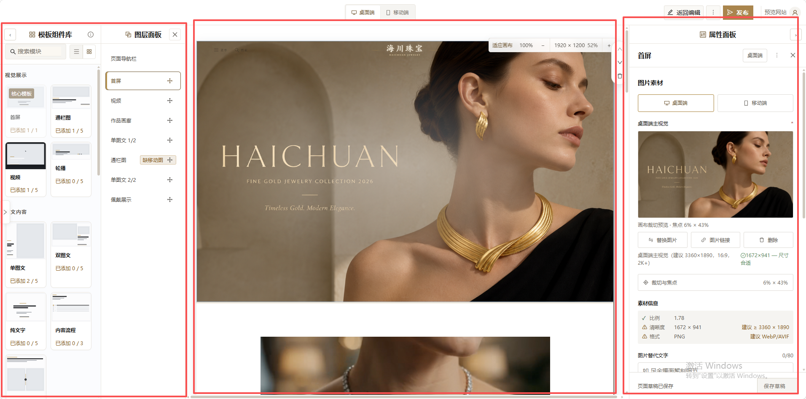

# 店铺装修编辑器优化方案 V3

日期：2026-08-20

## 用户确认的硬约束

1. 模板组件库、图层面板、中央画布、属性面板四个区域继续同时存在。
2. 不用页签合并两个左侧区域，不用自动隐藏属性面板改变工作框架。
3. 属性面板以直接修改模板的任务优先：图片第一、文字第二。
4. 高级感必须服从可读性、效率、状态清晰和低误操作。
5. 左侧“模板组件库 + 图层面板”的总宽度必须等于右侧属性面板宽度，使中央画布落在工作区几何中心。
6. 模板组件库比当前略宽，图层面板比当前更窄。
7. 画布上的常驻悬浮工具不得遮挡页面内容。
8. 本轮只给设计方案，不修改业务代码、模板合同、Puck 数据或公开 Renderer。

## 当前状态

健康度：结构正确，左右总宽尚未完全对称，画布工具存在遮挡。

截图为 1912px 宽：用户标注的左侧区域约 442px、中央区域约 1005px、右侧区域约 418px。左侧比右侧宽约 24px，因此中央区域的轴线向右偏约 12px。新的桌面基线把左右两侧统一为 440px，使画布相对可用工作区严格居中。

## 总体方向

采用“内容优先的精密工作台”：

- 画布是最高视觉焦点。
- 属性面板是第二操作焦点。
- 模板组件库负责添加，图层面板负责管理，保持辅助地位。
- 高级感来自真实图片、稳定网格、清楚层级、克制品牌金和一致交互，不增加大阴影、厚卡片、衬线功能字或过度留白。

## 四区布局

### 1. 模板组件库

- 1920px 桌面宽度调整为 272px，比当前约 240px 增加 32px。
- 模板库与图层面板合计固定 440px。
- 保留两列模块卡；缩略图、名称是主信息，使用量是次信息。
- “已添加 0/5”改为中性灰；达到上限或缺必要内容时才使用警告色。
- 黑色粗选中框退出常态，只在键盘焦点或拖拽时出现；添加反馈使用短暂成功提示。
- 分类标题可吸顶，但降低分隔线和滚动条噪音。

### 2. 图层面板

- 1920px 桌面宽度调整为 168px，比当前约 200px 减少 32px。
- 只保留结构管理必需的信息：模块名、选中状态、拖拽把手、可见性和质量问题。
- 当前模块使用细墨棕边、浅暖底和左侧 2px 品牌金标记；不要用大面积金色。
- 模块名允许单行省略，完整名称通过键盘可达的说明或选中详情获得。
- 上移、下移、隐藏、复制和删除收进选中图层的操作区；不再常驻悬浮在画布右侧。
- “缺移动图”“待完善”使用文字加图标，不能只靠颜色。
- 固定导航区域显示“固定”标识，与普通内容层区分。

### 3. 中央画布

- 外层网格使用“440px / minmax(0, 1fr) / 440px”；中央区域不再由不等宽侧栏挤偏。
- 画布文档在中央区域内部使用 margin-inline: auto，左右内边距保持相等。
- 继续使用自适应宽度，是整个页面唯一大面积视觉内容。
- 选中模块只显示清晰轮廓、模块名和操作锚点，不给图片加灰色蒙层，不改变亮度与色彩。
- 缩放、实际尺寸和适应画布迁移到中央区域顶部 40px 固定工具条，不再悬浮覆盖图片。
- 画布不常驻上移、下移和删除按钮；结构操作回到图层面板。
- 默认适应宽度；切换为 100% 时再允许横向滚动。
- 画布与工作区依靠细边界和极轻阴影区分，不增加厚重容器。

### 4. 属性面板

- 1920px 桌面固定为 440px，精确等于 272px 模板库与 168px 图层面板之和。
- 宽度不能因选中模块或切换设备动态变化，避免画布重新缩放和跳动。
- 固定头部只保留模块名、设备状态、更多和关闭。
- 头部下方增加紧凑任务锚点：图片、文字、行动、构图。它只负责滚动定位，不隐藏字段，不改变连续表单结构。
- 正文有效宽度约 400px；左右内边距以 20px 为基线。

### 桌面响应式对称基线

| 工作区宽度 | 左侧合计 | 模板库 | 图层 | 画布 | 属性面板 |
| --- | ---: | ---: | ---: | --- | ---: |
| ≥ 1600px | 440px | 272px | 168px | 自适应、居中 | 440px |
| 1440–1599px | 380px | 236px | 144px | 自适应、居中 | 380px |

低于 1440px 时继续保留四区结构和已有收起能力，但不要求四栏同时完全展开；任何展开组合仍须保证左右聚合宽度相等或将画布按可用区域重新居中。

## 悬浮工具重新归位

### 迁出画布

- “适应画布 / 100% / 缩小 / 尺寸与比例 / 放大”移到中央区域顶部的固定工具条。
- “上移 / 下移 / 复制 / 隐藏 / 删除”移到图层面板的选中模块操作区。
- 模板库收起、图层收起和属性面板收起按钮统一放进各自 44px 标题栏，不再悬停在栏间中线。

### 画布允许保留

- 2px 选中轮廓。
- 模块名称小标签，放在模块外沿左上角，不压住内容。
- 拖放时的插入线和“在此插入”短暂提示。
- 图片焦点编辑器只在用户进入“调整画面”模式后显示，完成即退出。

### 遮挡安全规则

- 任何常驻工具不得覆盖图片主体、前台导航、标题、按钮和交互热区。
- 工具条必须占据自己的布局高度，不能用负 margin 压入画布。
- 属性面板底部保存条保留，但滚动内容必须增加与保存条等高的安全内边距，最后一个字段不能被遮住。
- 临时菜单优先向所属面板内部展开；关闭、滚动或切换模块后立即收起。

## 属性面板的权威顺序

### 第一优先：图片素材

图片区域必须在面板顶部，并在选择模块后首先可见。

顺序：

1. 桌面端 / 移动端切换。
2. 大幅真实裁切预览。
3. 主操作“更换图片”。
4. 次操作“调整画面”。
5. 素材健康摘要。
6. 图片替代文字。
7. 链接与删除进入更多操作。

具体表现：

- 440px 面板内，预览使用接近满宽的真实比例；桌面图约 16:9，移动图按模板合同的移动比例。
- “图片链接”不是日常主任务，移入更多菜单。
- “删除”与更换图片分离，使用危险文字和二次确认。
- “裁切与焦点”改名为“调整画面”；百分比降为辅助信息，例如“焦点：左 6% · 上 43%”。
- 桌面/移动必须显示“继承桌面图片”或“已单独设置”，避免用户猜测。

素材状态合并为一条：

> 比例合适 · 清晰度不足 · PNG

若存在任何问题，摘要整体呈警告状态，不能同时在另一处显示“尺寸合适”。详细分辨率、建议尺寸和格式放在“查看素材详情”中。

### 第二优先：文字内容

字段按前台视觉重要性排序：

1. 主标题（必填）。
2. 副标题（可选）。
3. 眉题（可选）。
4. 其他说明文字。

优化原则：

- 不再把眉题放在主标题之前。
- 字段标签固定在左侧或输入框上方，整组保持同一种布局，不混用。
- 字数统计位于字段右上角，使用中性灰；接近上限才变为警告。
- 选填字段明确写“可选”，留空时说明“不显示”，减少试错。
- 修改继续实时同步画布，不额外增加“应用”按钮。

### 第三优先：行动与关联

- 文案改为更直白的“按钮文字”和“点击去向”。
- 点击去向保留“不跳转 / 商品 / 页面”三个选项。
- 当按钮文字为空时，点击去向自动降低权重并提示“填写按钮文字后生效”。
- 商品或页面的具体选择仅在对应类型选中后出现。
- 一个模板区块只突出一个主要行动。

### 第四优先：构图与设备

- “文字位置”使用带小示意图的有限预设，例如“居中”“左下”。
- 当前预设有清晰边框和文字，不只依赖品牌金颜色。
- 与图片裁切强相关的设置留在图片区；这里只保留模板级布局。
- 颜色、装饰、模板专属功能放在其后，使用较弱标题和更紧凑密度，不能抢过图片与文字。

## 右栏视觉规格

- 模块名：16 / 24px / 600。
- 区域标题：15–16 / 24px / 600。
- 字段标签与输入：14px。
- 辅助信息：12–13px，但必须使用满足对比度的中性灰。
- 相关字段间距约 16–20px；不同任务区约 28–32px。
- 控件高度以 36px 为主，主要操作 40px。
- 圆角控制在 3–4px；避免卡片墙、厚阴影和过度圆角。
- 深墨棕用于主操作和清晰焦点；品牌金只用于细边、选中标记和少量装饰。

## 保存与状态

- 保留右栏底部固定保存条，因为它符合用户完成内容编辑后的自然动作。
- 按钮明确写“保存整页草稿”，避免被理解为只保存当前模块。
- 状态文案明确写“修改已同步画布，尚未保存”或“页面草稿已保存”。
- 顶部保存与右栏保存必须调用同一页面级动作、共享同一 loading / disabled / success / error 状态。
- 发布仍只在顶部进行，避免右栏同时出现保存与发布两个高风险主操作。

## 实施优先级

### P0：直接影响主要编辑任务

1. 建立左右 440px 对称网格，内部拆分为模板库 272px 与图层 168px。
2. 移走画布缩放悬浮条和模块操作浮岛。
3. 固化任务顺序为图片、文字、行动、构图。
4. 图片预览与“更换图片 / 调整画面”成为右栏首屏主体。
5. 主标题移到文字区第一位。
6. 移除画布选中灰色蒙层，保持真实颜色。
7. 统一素材规格结论。

### P1：提高效率与可理解性

1. 增加图片、文字、行动、构图锚点导航。
2. 明确移动图片继承状态。
3. 重排行动入口的条件显示。
4. 明确“保存整页草稿”的范围。
5. 降低模板使用量和低频设置的视觉权重。

### P2：精修高级感

1. 统一边框、圆角、间距和字体层级。
2. 减少常显滚动条与重复分隔线。
3. 完善 hover、focus-visible、disabled、warning、error 和 success。
4. 在不改变四区结构的前提下微调宽度与响应式密度。

## 验收场景

1. 选中首屏后，第一屏无需滚动即可看到桌面/移动切换、图片预览、更换图片和调整画面。
2. 从图片区进入文字区，主标题是第一个文字字段。
3. 修改图片或文字后，画布实时更新且色彩不被选中态改变。
4. 素材状态只有一个明确结论，不出现成功与警告冲突。
5. 四个功能区域始终可辨，没有合并成标签栏或被自动隐藏。
6. 1920px 下左侧 440px、右侧 440px，中央区域轴线与可用工作区轴线重合。
7. 1440px 下左侧 380px、右侧 380px，画布仍为最大区域。
8. 选中前后侧栏宽度不变，画布不跳动。
9. 缩放和结构操作不遮挡画布内任何图片、文字、按钮或导航。
10. 键盘可访问任务锚点、设备切换、字段和保存；焦点清晰。
11. 检查未选择、已修改、保存中、保存成功、保存失败和发布阻断状态。

## 不改范围

- 不改变四区框架。
- 不改变模板数量、字段事实、Puck 文档结构或发布合同。
- 不更换全局字体、品牌色、Logo 或后台整体交互基调。
- 不创作或替换珠宝商品图片、品牌文案和营销内容。
