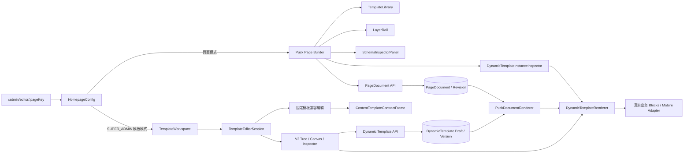
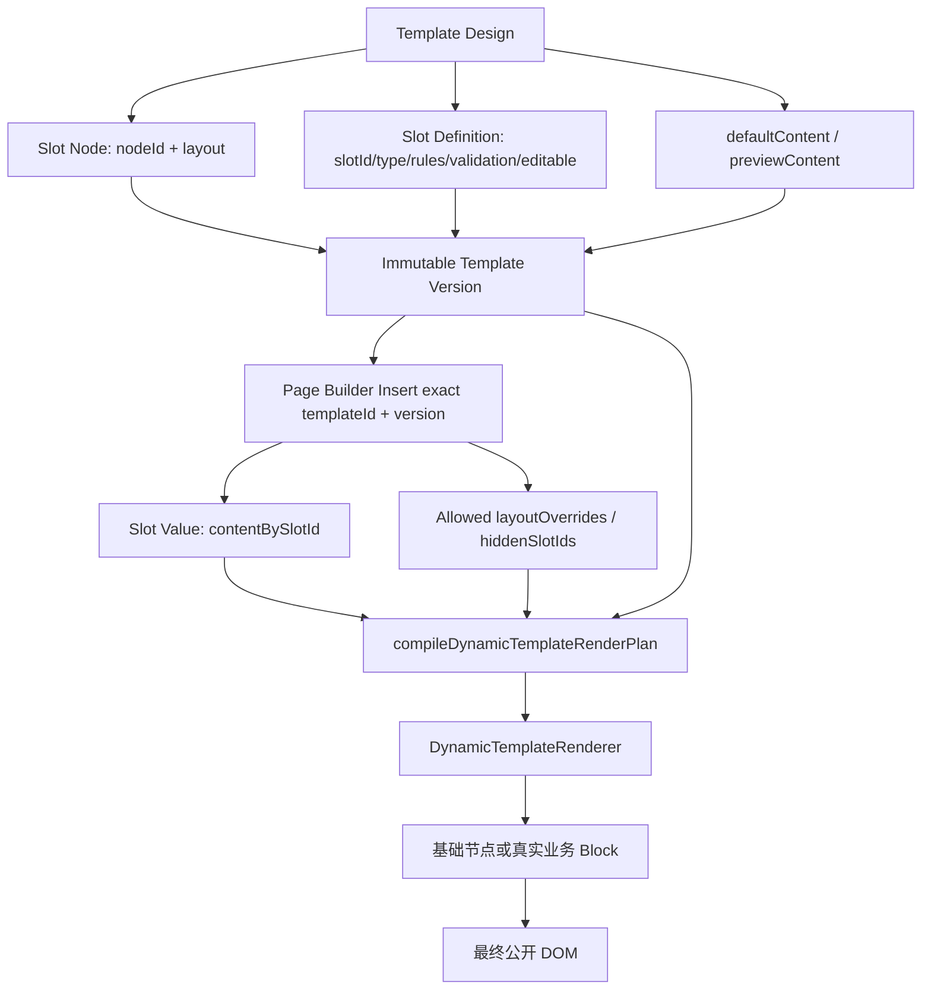
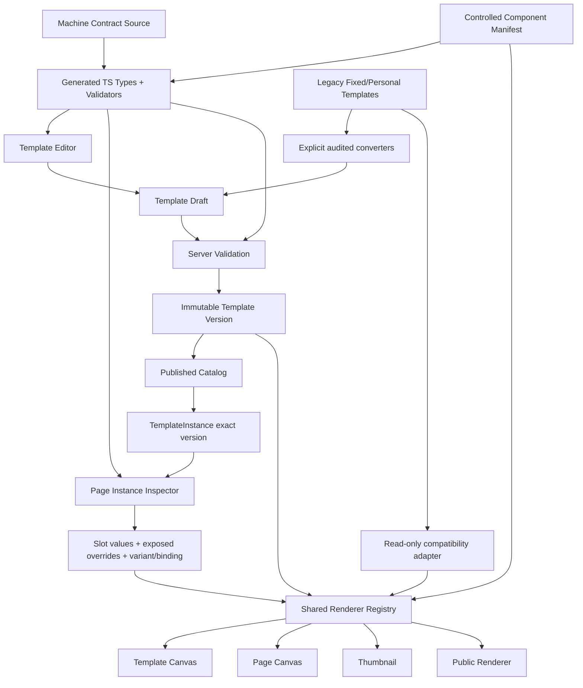
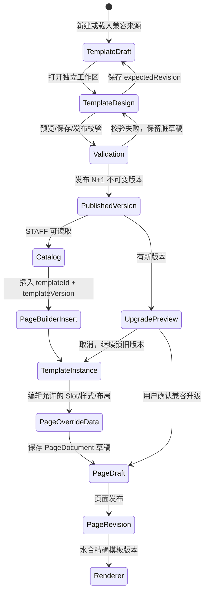

# 模板设计 / 页面装修系统专项代码审计（历史快照）

> 审计日期：2026-08-31
> 审计对象：当前 `G:\网站搭建2` 工作树快照
> 审计方式：先完成只读代码、合同、测试与配置审计，随后按 2026-08-31“单一母模板”决议实施代码收敛；未运行数据库迁移，未连接目标数据库，未操作浏览器中可能存在的未保存草稿。
> 证据边界：当前工作树包含大量未提交、已暂存和未跟踪修改，因此本文描述的是“当前工作树实现”，不是某个已提交版本，也不等于已部署生产状态。
> 现行性声明：本文只保留 2026-08-31 的审计证据，不是当前规则或路线图。2026-09-03 的 D.26 已将固定模板重新定位为兼容与起步样例，并取代本文关于新母模板可编辑 `defaultContent` / `previewContent`、固定模板数量代表产品范围或一般框架变更必须全验固定集合的建议；当前规则只认 `docs/page-builder/template-design-framework.md`。

## 2026-08-31 实施后结论（历史快照）

- 产品与运行入口现在只有一套母模板：页面装修和模板设计都消费 `TemplateDefinitionV2` 与服务端统一目录，不再由前端分别拼接系统、个人、正式和草稿列表。
- 模板保存保留“覆盖模板”和“另存为模板”两种身份语义；模板发布只创建不可变版本，既有页面继续锁定精确版本。
- 当时 `defaultContent`、`previewContent` 与 `emptyPolicy` 已形成合同，模板设计曾允许选择编辑默认内容或预览示例。该产品入口已由 D.26 的“系统只读示例、新母模板不保存默认内容”取代；字段只保留历史版本兼容读取。
- 复杂节点的模板布局和样式写入节点设计属性，业务默认/示例内容写入内容层；页面实例不能反向覆盖母模板受控设计。
- Activation 的控制器、服务、客户端调用和配置开关已删除；旧系统/个人模板的 HTTP 写路由、服务写方法和 DTO 也已删除。历史 migration、Prisma ledger 与 Gate B 纯内存规划器只为数据库兼容审计保留。
- 仍未完成的独立后续项是复合组件内部 parts 模型、完整声明式 ComponentManifest、公开精确版本缺失的可观测性，以及精确目标数据库的只读审计/migration 决策。这些缺口不再阻碍本轮单一母模板产品收敛，但不能被表述为生产迁移完成。

## 执行结论

【代码事实】项目已经存在一套实质性的统一模板模型 `TemplateDefinitionV2`，并非从零开始。它具备稳定 `templateId/nodeId/slotId`、结构树、Slot 定义、桌面/移动节点规则、实例编辑权限、服务端校验、草稿、不可变正式版本、精确版本页面引用和共享 Renderer。核心合同是 `contracts/page-builder/template-definition.schema.json`，生成的前后端类型分别位于 `client/src/page-builder/template-definition/generated/templateDefinition.generated.ts` 与 `server/src/modules/page-modules/generated/templateDefinition.generated.ts`。2026-08-31 后续收敛已删除无消费者的固定模板旧工作区组件；既有系统/个人来源现在经兼容适配直接进入统一 V2 编辑会话。

【代码事实】持久化与兼容层仍需识别 24 个固定内容模板合同、旧账号个人模板和 V2 模板三类来源，但产品只提供一套 `TemplateDefinitionV2` 母模板模型与目录。页面装修使用 Puck `PageDocument`；独立模板工作区使用自己的 Zustand `TemplateEditorSession`。两者不是同一个编辑器 Store，也不是简单把同一 Puck 实例裁剪成两个界面，但共享大量字段控件、业务组件、合同和最终 Renderer。

【代码事实】用户产生“拖入模板后没有东西可以继续设计”的关键代码原因，不是单纯右侧面板没做好，而是旧模板转换策略把“改款对比”等复杂组件和 16 类成熟内容模板转换为一个原子 Slot/复合叶子节点。V2 结构树只能看到并选择外层 `BeforeAfter`、`HeroTemplate` 等节点；内部 `before/after/divider/handle/copy/action` 仍封装在 React Renderer 内，不是独立 V2 node。证据见 `client/src/page-builder/template-editor/legacyTemplateConversion.ts:354-395`、`client/src/page-builder/template-definition/dynamicTemplateNodeAdapters.tsx` 和 `client/src/components/blocks/BeforeAfterBlock.tsx`。

【代码事实】当前并不缺 Property Schema。旧页面模块已有声明式 `ModuleInspectorSchema -> SectionDef -> FieldDef -> FieldRenderer`；V2 也有 `node.type -> node registry -> DynamicTemplateInspectorPanel`。真正缺口是：两套属性描述没有统一成一个组件注册清单，复合组件的内部部件没有可寻址模型，且 V2 Inspector 主要是手写条件分支，不是完全由注册表声明生成。

【存在风险】如果产品对外把当前功能称为“所有模板均可自由内部设计”，这是功能承诺与数据模型不一致的 P0 发布风险。代码层未发现“发布新模板版本会自动改写历史页面”的路径；相反，现有精确版本和不可变版本设计是本系统最值得保留的部分。

【你的推断】推荐路线不是再建立第四套 TemplateDefinition，而是在现有 V2 上增量扩展“组件清单、复合部件模型、嵌套字段暴露策略、Variant 与显式默认内容策略”，逐步收敛旧固定模板。页面历史版本锁定和显式升级原则不应被推翻。

---

## 一、项目架构

### 1.1 技术栈与 package 职责

【代码事实】本项目不是 npm workspace。根目录、`client/`、`server/` 各自有 `package.json` 与 `package-lock.json`：

| 层级 | 当前技术 | 主要证据 |
|---|---|---|
| 根编排 | Node.js 22.x、npm、合同生成与校验脚本 | `package.json`、`scripts/generate-template-definition-contract.mjs` |
| 前端 | React 18、TypeScript、Vite、React Router | `client/package.json`、`client/src/App.tsx` |
| 页面编辑器 | Puck `@puckeditor/core` 0.22.4 | `client/package.json`、`client/src/pages/admin/HomepageConfig/index.tsx:5147` |
| 状态管理 | Puck Store + Zustand + 页面级 React state | `client/src/pages/admin/HomepageConfig/editor-store.ts`、`templateEditorSession.ts` |
| UI | Ant Design；项目内 CSS；Tailwind 依赖仍存在 | `client/package.json`、`client/src/pages/admin/HomepageConfig/editor.css` |
| 拖拽 | 页面库自定义 Pointer/DOM 定位 + Puck 画布；V2 树使用 HTML Drag Events | `HomepageConfig/index.tsx`、`DynamicTemplateStructurePanel.tsx` |
| 数据请求 | Axios 封装及 domain clients | `client/src/services/api.ts`、`client/src/services/clients/dynamicTemplateClient.ts` |
| 后端 | NestJS 11、TypeScript、class-validator | `server/package.json`、`server/src/modules/page-modules/` |
| ORM / DB | Prisma 5.8、MySQL Schema | `server/prisma/schema.prisma` |
| 页面持久化 | `PageDocument` 草稿 + `PageDocumentRevision` 正式快照 | `server/prisma/schema.prisma:1177-1221` |
| 模板持久化 | `DynamicTemplate` + Draft + immutable Version | `server/prisma/schema.prisma:1281-1350` |

【存在风险】`server/prisma/migrations/20260828200000_add_dynamic_template_versioning` 等迁移位于当前未提交工作树中。本审计没有执行迁移或核验目标数据库，因此“代码模型存在”不能表述为“目标数据库已具备”。

### 1.2 模板专项目录结构

```text
G:/网站搭建2
├─ contracts/page-builder/
│  ├─ content-templates.contract.json       # 24 个固定模板机器合同
│  └─ template-definition.schema.json       # V2 母模板与页面实例合同源
├─ client/src/page-builder/
│  ├─ config/puckConfig.tsx                 # 页面装修 Puck 组件注册
│  ├─ inspector/                            # 页面模块属性 Schema 与控件
│  ├─ template-editor/                      # 独立模板工作区
│  ├─ template-definition/                  # V2 类型、校验、操作、渲染
│  ├─ dynamic-template-instance/            # 页面中的 V2 实例与升级
│  ├─ runtime/                              # 公开 PageDocument Renderer
│  └─ layout/                               # 固定模板合同派生布局/CSS
├─ client/src/pages/admin/HomepageConfig/   # 页面装修主编辑器
├─ client/src/services/clients/             # 页面/模板 API client
├─ server/src/modules/page-modules/          # DTO、Service、Controller、校验
├─ server/prisma/schema.prisma               # 页面与模板数据库模型
└─ scripts/                                  # 合同生成、检查、验收脚本
```

---

## 二、页面装修与模板设计两套系统

### 2.1 页面装修 A

| 关注项 | 当前实现 |
|---|---|
| 路由 | `/admin/editor/:pageKey`，入口落到 `EditorWorkbench`；无效 pageKey 重定向到 `/admin/editor/home`。见 `client/src/App.tsx`、`EditorWorkbench/index.tsx:8-14` |
| 页面入口 | `HomepageConfig`，在单个大组件内编排加载、保存、发布、页面/模板模式 |
| 核心画布 | 一个 `<Puck config={editorConfig} data={data}>`，见 `HomepageConfig/index.tsx:5147` |
| 左侧库 | `TemplateLibrary`，固定模块、个人模板与已发布动态模板；动态模板插入走 `insertPublishedDynamicTemplate` |
| 结构树 | `LayerRail` 读取 Puck content 并驱动选中/排序 |
| 属性面板 | `InspectorPanel`；普通模块进入 `SchemaInspectorPanel`，动态实例进入 `DynamicTemplateInstanceInspector` |
| 拖拽 | Puck 原生组件拖动权限被限制；库侧实现 Pointer 拖拽、命中画布和插入索引；画布内部仍由 Puck 管理内容顺序 |
| 选中 | `useHomepagePuck()` 读取 Puck selected item；固定模板内部又通过 `useVisualEditorSession` 选中 `data-content-role` 对象 |
| 状态 | `HomepageConfig` React state 保存 `data/metadata/dirty/revisions`；Puck Store 见 `editor-store.ts:8-13`；固定模板视觉编辑另有 Zustand session |
| 加载 | 并行读取已发布快照、管理端草稿与个人模板；草稿作为工作副本，正式快照作为基线，见 `HomepageConfig/index.tsx:3946-3947` |
| 保存 | `pageDocumentApi.save`，包含 `pageKey/puckData/metadata/editorVersion/expectedUpdatedAt`，见 `HomepageConfig/index.tsx:4181` |
| 校验 | 页面端防抖校验与发布前 `pageDocumentApi.validate`；最终必须以服务端校验为准，见 `HomepageConfig/index.tsx:4838` |
| 发布 | 先保存草稿，再调用 `pageDocumentApi.publish`，服务端生成 `PageDocumentRevision` 并切换 `publishedRevisionId`，见 `HomepageConfig/index.tsx:4976`、`page-modules.service.ts:738-830` |
| 预览 | Puck Preview 与公开 `PuckDocumentRenderer`；动态实例按精确版本注入 definition |

### 2.2 模板设计 B

| 关注项 | 当前实现 |
|---|---|
| 路由 | 没有独立 URL；由同一个 `HomepageConfig` 顶部模式切换进入。仅 `SUPER_ADMIN` 可管理模板，见 `HomepageConfig/index.tsx:3356,3469-3593` |
| 页面入口 | Lazy `TemplateWorkspace`，见 `HomepageConfig/index.tsx:184-186,5248-5258` |
| 核心四区 | `TemplateEditorLibrary`、统一 V2 结构树、V2 Canvas、V2 Inspector，见当前 `TemplateWorkspace.tsx` |
| 左侧库 | 一套母模板目录；既有系统/个人来源由兼容适配直接载入 V2，会话中不再并列展示产品格式 |
| 画布 | 统一使用 `DynamicTemplateCanvas`，直接调用共享 `DynamicTemplateRenderer` |
| 结构树 | 统一使用 `DynamicTemplateStructurePanel`，支持选中、拖换父级、排序、复制、显隐、删除 |
| 属性面板 | 统一使用 `DynamicTemplateInspectorPanel` |
| 状态 | 独立 Zustand `TemplateEditorSession`：draft、baseline、selectedObjectId、desktop/mobile、dirty、undo/redo、preview、saveStatus；历史上限 50 |
| 选中 | `selectObject(nodeId)`；V2 Canvas 与结构树共享稳定 nodeId |
| 保存 | V2 远端走 create/updateDraft/saveAs；Mock 环境才使用本机草稿仓库。既有系统/个人来源只读，选择时由兼容适配直接载入 V2；首次覆盖建立稳定统一模板身份，另存为始终创建新身份 |
| 发布 | `POST /page-modules/dynamic-templates/:templateId/publish`；创建 N+1 不可变版本并保留下版草稿，不自动升级页面 |
| 预览 | `DynamicTemplateCanvas` 合并 `defaultContent + previewContent` 并调用真实 Renderer；支持 default/empty/long-text/missing-image 场景 |

### 2.3 两套系统的关系

1. 【代码事实】两者是两个独立编辑会话：页面装修的事实源是 Puck `data`；模板设计的事实源是 `TemplateEditorSession.draft`。Undo/redo、dirty、设备和保存状态不会串用。
2. 【代码事实】它们共享外层工作区控件、字段控件、媒体/商品/链接选择器、机器合同、V2 Renderer 和真实业务 Block。
3. 【代码事实】V2 模板画布、页面实例、缩略图和公开页最终都调用 `DynamicTemplateRenderer`；复杂节点再转到 `BeforeAfterBlock` 等真实组件。
4. 【代码事实】固定模板内部视觉设计仍走 `ContentTemplateContractFrame` 和 `data-content-role`；这不是 V2 node schema。
5. 【你的推断】重复主要集中在“属性能力描述”和“适配分派”：旧 `ModuleInspectorSchema`、V2 node registry、`DynamicComplexContentFields`、`dynamicTemplateNodeAdapters` 各自维护部分组件知识。不是简单重复 JSX，而是同一事实被多张表描述。
6. 【代码事实】模板设计不是页面装修的纯裁剪版。它复用了组件与控件，但有独立 Store、结构操作、草稿/版本 API；固定模板兼容区看起来更像对旧页面视觉编辑能力的只读/转换包装。



---

## 三、“模板”在系统里到底是什么

### 3.1 三种真实模型

| 模型 | 代码形态 | 保存内容 | 当前定位 |
|---|---|---|---|
| 固定系统内容模板 | `content-templates.contract.json` + Puck adapter + `ContentTemplateInstanceOverridesV2` | moduleType、合同版本、固定角色、允许控件、双端布局覆盖 | 已有页面兼容与 V2 转换来源；不能直接发布新固定版本 |
| 旧个人模板 | Prisma `PersonalContentTemplate` | owner、name、moduleType、contractKey/version、layoutData、可选白名单 contentDefaults、revision | 只读迁移来源 |
| V2 动态模板 | `TemplateDefinitionV2` + Prisma DynamicTemplate/Draft/Version | 结构树、Slot、默认/预览内容、双端规则、元信息、实例权限、正式版本 | 新模板唯一推荐写路径 |

【代码事实】当前固定合同为 `contractSchemaVersion=8`、`registryVersion=18`、`publicationGateVersion=3`，共有 24 个活动模板；“改款对比”为 version 6。事实源是 `contracts/page-builder/content-templates.contract.json`。

### 3.2 V2 TemplateDefinition 实际保存什么

`TemplateDefinitionV2` 位于生成类型 `templateDefinition.generated.ts:840-851`，顶层字段为：

- `schemaVersion`：当前 JSON Schema 固定为 1；类型名称虽然叫 V2，内部 schemaVersion 仍为 1。
- `templateId/name/description`。
- `metadata`：category、purpose、layoutType、slotSummary、recommendedFor、desktop/mobile ratio、预览宽度、mobileBreakpoint、viewport 边界、background token、visualRole、headerCompatibility、tags。
- `rootNodeId` 与 `nodes: Record<nodeId, DynamicTemplateNode>`。
- `slots: Record<slotId, DynamicTemplateSlotDefinition>`。
- `defaultContent` 与可选 `previewContent`。

数据库层另保存 owner、sourceType、visibility、status、publishedVersion、archive 状态、Draft revision/checksum、Version number/checksum/note/publisher/time。见 `server/prisma/schema.prisma:1281-1350`。

【代码事实】当前没有顶层 `componentType`、通用 `style` 对象、`actions` 图、`dataBinding/dataSource`、`variants`、thumbnail 二进制/URL、独立 `propertySchema/exposedProperties` 字段。部分同类能力分散在 `node.type`、responsive rules、slot rules、validation 和 `instanceEditPolicy` 中。

### 3.3 当前 Template JSON 示例

以下内容直接还原自服务端真实测试夹具 `server/src/modules/page-modules/dynamic-template-test-fixture.ts:16-98`，仅为排版压缩了重复的 responsive 空字段：

```json
{
  "schemaVersion": 1,
  "templateId": "tpl_server_validation",
  "name": "服务端动态模板校验",
  "description": "在数据库持久化前验证服务端不信任客户端 JSON。",
  "metadata": {
    "category": "内容展示",
    "purpose": "服务端校验回归",
    "layoutType": "纵向内容",
    "slotSummary": "1 个标题槽位",
    "recommendedFor": ["home"],
    "desktopRatio": "16:9",
    "mobileRatio": "4:5",
    "previewDesktopWidth": 1200,
    "previewMobileWidth": 390,
    "minViewportWidth": 320,
    "maxViewportWidth": 1920,
    "defaultBackgroundToken": "surface",
    "tags": ["server"]
  },
  "rootNodeId": "node_root",
  "nodes": {
    "node_root": {
      "nodeId": "node_root",
      "type": "Section",
      "name": "模板根节点",
      "childIds": ["node_container"],
      "props": { "semanticTag": "section" },
      "responsive": {
        "desktop": { "display": "block", "order": 0, "width": "fill", "height": { "mode": "auto" } },
        "mobile": { "display": "block", "order": 0, "width": "fill", "height": { "mode": "auto" } }
      },
      "hidden": false
    },
    "node_container": {
      "nodeId": "node_container",
      "type": "Container",
      "name": "内容容器",
      "childIds": ["node_heading"],
      "props": {},
      "responsive": {
        "desktop": { "display": "flex", "direction": "column", "order": 0, "width": "fill", "height": { "mode": "auto" } },
        "mobile": { "display": "flex", "direction": "column", "order": 0, "width": "fill", "height": { "mode": "auto" } }
      },
      "hidden": false
    },
    "node_heading": {
      "nodeId": "node_heading",
      "type": "HeadingSlot",
      "name": "主标题",
      "slotId": "slot_heading",
      "childIds": [],
      "props": {},
      "instanceEditPolicy": {
        "position": true,
        "size": true,
        "zIndex": true,
        "imageFit": false,
        "imageFocus": false,
        "typography": true,
        "spacing": true,
        "minWidthPercent": 25,
        "maxWidthPercent": 150,
        "maxOffsetPercent": 30,
        "minFontSizePx": 12,
        "maxFontSizePx": 96,
        "maxSpacingPx": 120
      },
      "responsive": {
        "desktop": { "display": "block", "order": 0, "width": "fill", "height": { "mode": "auto" } },
        "mobile": { "display": "block", "order": 0, "width": "fill", "height": { "mode": "auto" } }
      },
      "hidden": false
    }
  },
  "slots": {
    "slot_heading": {
      "slotId": "slot_heading",
      "key": "heading",
      "type": "heading",
      "label": "主标题",
      "required": false,
      "editable": true,
      "hideable": true,
      "validation": { "maxLength": 60 },
      "desktopRules": { "fontRole": "display", "maxLines": 2 },
      "mobileRules": { "fontRole": "heading", "maxLines": 3 }
    }
  },
  "defaultContent": { "slot_heading": "光，沿线而生" }
}
```

页面装修插入它时不会复制整份 definition，而是保存轻量实例：

```json
{
  "instanceId": "instance_uuid",
  "templateId": "tpl_server_validation",
  "templateVersion": 1,
  "contentBySlotId": {},
  "layoutOverridesByNodeId": {},
  "hiddenSlotIds": [],
  "isVisible": true
}
```

证据见 `client/src/page-builder/dynamic-template-instance/types.ts:52-67`。

---

## 四、模板内部 Node / Component 模型

### 4.1 Node 字段与能力

```text
DynamicTemplateNode
├─ nodeId: stable id
├─ type: DynamicTemplateNodeType
├─ name
├─ slotId?: stable slot reference
├─ childIds: ordered child ids
├─ props
│  ├─ semanticTag
│  ├─ dividerStyle / spacerSize
│  └─ legacy mature adapter layoutData / designProps
├─ instanceEditPolicy?: 页面实例可覆盖能力与数值边界
├─ responsive.desktop
├─ responsive.mobile
└─ hidden
```

【代码事实】Schema 对对象统一 `additionalProperties: false`；node/slot id、父子关系、唯一性、循环、孤儿节点、slot 类型匹配、数值范围等由前后端同源校验器检查。见 `template-definition.schema.json:217-245` 与 `validateTemplateDefinition.ts`。

【代码事实】结构节点包括 Section、Container、Grid、Row、Column、Stack、Spacer、Divider；内容节点包括基础 Slot、复杂业务组件和成熟模板 wrapper。注册表明确 `allowedParents/rootOnly/canHaveChildren/slotType`，见合同 `x-nodeRegistry`。

### 4.2 对十个问题的回答

1. 节点可选中：是。结构树、Canvas 点击和键盘都用稳定 nodeId。
2. 系统知道类型：是。`node.type` 进入生成 registry 与 renderer adapter。
3. 不同类型 Inspector：部分。结构/Slot/复杂 Slot 有条件分支和共享字段；但不是每个 node type 独立声明式 Inspector。
4. style schema：部分。布局、间距、背景/border token、radius、overflow 在 responsive；文字/图片规则在 SlotRules；没有任意 CSS style。
5. props schema：很窄。`DynamicTemplateNodeProps` 只有少数已声明属性；复杂业务内容在 Slot value 中，由复用字段组件处理。
6. editable/configurable：有。Slot 有 editable/hideable，Node 有 `instanceEditPolicy`；但复合 Slot 只有整体 editable，缺少嵌套字段级策略。
7. 约束：有 required/min/max/enum/hidden/只读 UI；Schema 与 validator 均执行。只读主要是 UI/权限语义，不是通用 node `readonly` 字段。
8. 新增/删除/复制/排序：V2 支持；固定旧模板不支持自由改树。
9. 改布局：V2 可改节点双端 display/direction/order/width/height/gap/spacing/alignment/grid 等；页面实例只可改母模板授权的稀疏几何。
10. 改 responsive：支持 desktop/mobile 两档真实持久化；不支持独立 tablet。

### 4.3 为什么“拖入模板后没有东西可设计”

【代码事实】空 V2 模板初始只创建 Section root，用户需要从 `DynamicTemplateToolbox` 添加结构或 Slot；这会形成“只有空画布”的第一层感知问题。

【代码事实】更深层原因是转换粒度：`legacyTemplateConversion.ts:354-395` 对成熟模板和复杂模板分别执行两种原子化转换：

- 成熟模板：创建一个 `HeroTemplate/...` Slot node，将旧 `layoutData` 塞进 `node.props.contentTemplateLayoutData`，内部结构继续由旧 Renderer 负责。
- 复杂模板：创建一个 `BeforeAfter/Carousel/...` Slot node，将所有字段塞进一个对象 value；不会把内部部件转成 child node。

【代码事实】`BeforeAfterBlock` 内部确实有 `before`、`after`、`comparisonHandle` 和 `copy` DOM role，但这些是 React DOM 属性，不是 V2 nodes。`DynamicTemplateRenderer` 选择的是外层 nodeId，无法天然选择内部 divider/handle/title。

【你的推断】因此用户看到的是“一个完整模板预览”，结构树却只有一个叶子；Inspector 能编辑外层几何和整包内容，却无法继续拆解内部构图。这是模型粒度不一致，不是多加几个按钮就能解决。

---

## 五、内容槽位 Slot

### 5.1 Slot 当前是什么

【代码事实】V2 Slot 不是普通 child node，也不是数据绑定。它是两段式模型：

- 树中的 Slot node：提供位置、父子关系、双端几何、选中身份。
- `slots[slotId]`：提供内容类型、key/label、required/editable/hideable、验证和双端展示规则。

页面实例的真实值位于 `contentBySlotId[slotId]`。渲染计划按“实例值优先，否则 defaultContent”合并，见 `renderPlan.ts:63` 和服务端 `dynamic-template-instance.ts:451`。

固定旧模板中的 before/after/media/copy/action 则是 `content-templates.contract.json` 的 role/editableObject 和 Puck props，不是同一种 SlotDefinition；转换后才进入 V2 Slot。

### 5.2 类型与能力

| 能力 | 当前状态 |
|---|---|
| 图片/标题/文本/富文本/按钮/链接/徽标/图标 | 有独立 slot type |
| 商品/集合 | 有基础 product/collection slot |
| 视频/轮播/热区/前后对比/预约 | 有复杂 slot adapter |
| 商品卡/商品集合/分类集合 | 有业务 slot adapter，使用稳定业务引用 |
| 16 类成熟内容模板 | 作为原子 wrapper slot type 接入 |
| 任意自定义组件 | 没有运行时任意组件名；只能扩展受控 node registry 和 adapter |
| 默认值 | `defaultContent` 支持；但当前 V2 Inspector 只编辑 `previewContent`，正式默认值没有清晰 UI 写路径 |
| 必填 | `required`，页面发布校验执行；必填实例内容不能只依赖母模板回退 |
| 长度/数量 | `minLength/maxLength/minItems/maxItems` |
| 图片规则 | recommendedWidth/Height + desktop/mobile aspectRatio/objectFit/objectPosition |
| 空值策略 | 部分：required/hideable/Renderer 空值行为；没有统一显式 enum（hide/placeholder/fallback/error） |
| 数据源/字段绑定 | 完全缺失通用模型；商品/分类是专用稳定引用字段，不等于通用 binding |
| 页面装修可编辑 | `slot.editable` 决定内容；`hideable` 决定隐藏；node policy 决定布局 |
| 模板设计可编辑 | 可编辑 Slot 定义、规则、权限与中性预览内容；正式 defaultContent UI 不完整 |

### 5.3 完整数据链



【存在风险】`previewContent` 的 Schema 描述明确写着不得进入公开渲染，但 Inspector helper 会在 previewContent 缺失时回读 defaultContent。命名和 UI 文案容易让运营误以为自己设置的是正式默认内容。应在产品层显式区分“预览样例”和“页面空值回退”。

---

## 六、模板设计右侧属性面板

### 6.1 当前选择映射

| 选中对象 | V2 Inspector 当前显示 |
|---|---|
| 未选中 / root | 模板名称、分类、用途、布局类型、描述、比例、预览宽度、breakpoint、viewport、背景 token、视觉角色、页面适用、tags、版本说明；root 自身也显示节点布局 |
| 容器 / Layout Node | 节点名、父节点、隐藏、类型/id；当前设备 display/direction/order/width/height/gap/padding/margin/alignment/grid/background/border/radius/overflow |
| 基础图片/文本 Slot | 上述节点布局 + Slot 名称/key/required/editable/hideable + instance policy + 预览内容 + validation + 双端 SlotRules |
| Action Slot | Button/Link 作为 Slot，内容字段由类型分支处理；没有独立 action graph |
| 复杂 Slot | 复用 `DynamicComplexContentFields`，一次编辑整包业务对象；内部部件不是选中对象 |
| 兼容来源对象 | 兼容适配生成统一 V2 定义后，由 `DynamicTemplateInspectorPanel` 编辑；旧来源保持只读，不再存在独立固定模板属性面板 |

### 6.2 是否存在 selectNode -> type -> schema -> editor

【代码事实】存在前半段：`selectObject(nodeId) -> definition.nodes[nodeId].type -> getDynamicTemplateNodeRegistryEntry(type)`。`DynamicTemplateInspectorPanel.tsx:263-320` 会根据节点类型显示身份与布局。

【代码事实】存在旧页面模块的完整声明式链：`ModuleInspectorSchema.sections[].fields[] -> FieldRenderer`，字段 key 直接对应 Puck props。类型定义见 `inspector/schema/types.ts:47-253`，前后对比 schema 见 `inspector/schema/modules/beforeAfter.ts`。

【代码事实】V2 没有完整的“每个 node type 在 registry 中声明 inspector schema”链。V2 Inspector 通过 `isImageSlot/isVideoSlot/complexSlotType/supportsTypography` 等手写分支拼装控件；复杂内容再桥接旧 schema 控件。

【你的推断】所以“属性面板不知道给什么能力”的根因不是全项目没有 Property Schema，而是组件知识分散：Node registry 只描述树约束；SlotDefinition 描述内容合同；旧 `ModuleInspectorSchema` 描述表单；adapter 描述渲染。没有一份受控 `ComponentManifest` 把这些关联起来。

【代码事实】“右侧只能编辑元信息”的描述对空 root 或复合 wrapper 的第一印象成立，但对完整 V2 基础节点不完全成立：当前代码已经能编辑相当多的节点布局和 Slot 规则。不能把现状误判成纯元信息编辑器。

---

## 七、Responsive 模型

【代码事实】当前属于 B：节点级响应式属性会被真实保存，而不是仅切换预览宽度。每个 Node 必须同时含：

```ts
responsive: {
  desktop: DynamicTemplateResponsiveRules;
  mobile: DynamicTemplateResponsiveRules;
}
```

支持 display、direction、order、width、height、maxWidth、minHeight、gap、padding、margin、alignItems、justifyContent、columns、backgroundToken、borderToken、radius、overflow。Slot 另有 desktopRules/mobileRules。Schema 见 `template-definition.schema.json:149-176,263-305`。

【代码事实】模板 metadata 还能保存 `mobileBreakpoint`；Renderer 根据当前 device 使用对应规则。模板画布的 desktop/mobile 是对真实两套规则的编辑入口。

【代码事实】没有独立 tablet 字段。768 等中间宽度由 `mobileBreakpoint` 二分为 desktop 或 mobile，并非三档保存。

【存在风险】项目旧固定模板还使用 CSS media query、合同 desktop/mobile order、组件内 `@media (max-width: 767px)` 等响应式逻辑。成熟 wrapper 节点外层服从 V2，而组件内部仍服从旧 Renderer 的 breakpoint，可能出现外层 breakpoint 与内层 767px 规则不一致。当前测试覆盖多个宽度有助于发现问题，但模型仍是双层响应式事实。

---

## 八、模板设计与页面装修应如何分工

| 目标能力 | 当前判断 | 说明 |
|---|---|---|
| 模板定义内部结构 | 【已经具备】 | V2 nodes/root/childIds |
| Layout | 【已经具备】 | 节点 desktop/mobile responsive rules |
| 默认样式 | 【部分具备】 | token、SlotRules、少量 node props；复合组件内部样式多为硬编码 |
| Slot / Data Contract | 【已经具备】 | SlotDefinition + validation + server validator |
| Editable Props | 【部分具备】 | slot editable/hideable + instanceEditPolicy；缺嵌套字段级暴露 |
| Responsive Rule | 【已经具备】 | desktop/mobile；无 tablet |
| Variant | 【完全缺失】 | 无 schema、实例字段、迁移或 Inspector |
| Constraint | 【已经具备/部分具备】 | 基础范围与树约束较强；缺复合部件和空值策略 |
| Default Content | 【部分具备】 | 数据模型/renderer 支持，V2 编辑 UI 只写 previewContent |
| Data Binding | 【完全缺失】 | 商品/分类专用引用可复用，但没有通用 binding |
| 页面只改允许暴露内容 | 【已经具备】 | slot editable + hidden + node instance policy |
| 页面暴露样式参数 | 【部分具备】 | typography/spacing/image fit/focus/几何；无通用 exposed properties |
| 页面选择 Variant | 【完全缺失】 | 当前实例没有 variantId |
| 页面级布局 | 【已经具备】 | Puck block 顺序 + 授权稀疏 node overrides |
| 同一 schema 渲染 | 【部分具备】 | V2 是；成熟 wrapper 内仍进入旧合同 Renderer |

【你的推断】总体距离目标不是“重写全部”的距离。版本、Slot、基础树、双端规则和 Renderer 主链已具备；最大工作量在复合组件建模、属性清单收敛和旧模板迁移质量，而不是 CRUD。

---

## 九、Property Schema / Editable Schema 专项判断

### 9.1 已存在的机制

【代码事实】旧页面模块：

```text
ModuleInspectorSchema
  -> sections: SectionDef[]
    -> fields: FieldDef[]
      -> control: text/textarea/segmented/number/switch/select/color/
                  media/video/linkTarget/productReferences/
                  categoryReferences/preset/custom/array
      -> FieldRenderer
```

它具备 label、hint、required、maxLength、min/max/step、options、visibleWhen、device 和复合数组等能力。见 `client/src/page-builder/inspector/schema/types.ts`。

【代码事实】V2 的机器合同也具备结构/数值约束和编辑权限，但不是表单呈现 Schema。`x-nodeRegistry` 只描述 node kind、父级和 children。

### 9.2 核心缺口

【你的推断】应建立“编译期受控组件清单”，而不是把 Inspector JSX 塞进可持久化 JSON。该清单把 node type、slot type、renderer adapter、内容 schema、Inspector schema、空值策略、默认 instance policy 和迁移器关联起来；持久化定义只保存清单允许的值。

【存在风险】如果直接在 JSON 中允许任意组件名、任意 CSS 或任意表单配置，会破坏当前服务端 fail-closed 校验和公开 Renderer 白名单，应避免。

---

## 十、保存、发布、版本与再加载

### 10.1 生命周期追踪

1. 进入模板：`HomepageConfig` 与 `TemplateEditorLibrary` 读取同一个服务端统一目录；正式版本直接使用，旧系统/个人来源只在内存中适配为统一 draft。
2. 打开会话：`TemplateEditorSession.open()` 克隆 draft/baseline，生成独立 sessionId。
3. 编辑：`commitDraft()` 深拷贝入历史，计算 dirty；undo/redo 限 50。
4. 自动保存：未发现通用远端自动保存计时器；明确“保存模板”是主写路径。Mock 本机保存不证明服务端持久化。
5. 保存草稿：create 或 PATCH draft，携带 `expectedRevision`，服务端重新校验 definition、锁 templateId、更新 checksum/revision。
6. 发布：POST publish；事务中再次校验 draft 与 checksum，创建 `DynamicTemplateVersion(version=N+1)`，更新 `publishedVersion`，保留下版 Draft。
7. 页面插入：从 published catalog 创建 `TemplateInstanceV2`，锁 `templateId + templateVersion`。
8. 页面保存：只保存实例内容/稀疏 override/hidden/visible；`resolvedDynamicTemplates` 是读取时注入缓存，不持久化。
9. 公开再加载：`PageDocument.publishedRevisionId` 指向 immutable page revision；服务端按实例引用水合精确 template version，前端 Renderer 消费。
10. 模板升级：页面实例显示 vN -> vN+1 差异；只迁移兼容 slotId/type，新增必填未填时阻断；用户确认后只改当前页面草稿。

### 10.2 六个关键问题

1. 模板有 version：有。Draft 有 revision/baseVersion，正式版本有递增 version。
2. 页面引用：同时引用 templateId 与精确 templateVersion。
3. 模板修改是否改变历史页面：正常路径不会。发布测试明确断言不读取/修改 PageDocument、Revision、Scheme，见 `dynamic-templates.service.spec.ts:705`。
4. 草稿/已发布：均支持，正式 version 不可变，FK `onDelete: Restrict`。
5. 页面实例 snapshot：实例不内嵌整份 definition；页面正式版本是整页 Puck snapshot，模板定义按精确版本外部解析。
6. 页面实例保存什么：`contentBySlotId/layoutOverridesByNodeId/hiddenSlotIds/isVisible`，不允许注入 nodes 或 definition。

### 10.3 线上升级风险

【代码事实】主路径有较强保护：精确版本、checksum、服务端校验、显式升级、发布 revision 指针、模板 version Restrict 删除。

【存在风险】公开 `DynamicTemplateInstanceView` 在精确 definition 缺失或身份不一致时返回 `null`，编辑态才显示错误。安全上是 fail-closed，但运营结果是模块静默消失。建议公开渲染层记录可观测错误，并在发布/回滚/目标数据库审计中保证所有精确引用可解析。

【代码事实】`DynamicTemplateActivation` 的运行时控制器、服务、客户端与配置开关已删除。历史 migration、Prisma ledger 模型和只读迁移规划器仍在工作树中，用于未确认数据库状态的兼容审计，不能把这些历史资产解释为可启用的批量切换能力。

【存在风险】当前工作树中的 Prisma migration 未经本审计执行或目标库验证；这仍是发布门禁，不是架构已完成的证据。

---

## 十一、“前后对比模板”案例

### 11.1 当前真实组成

【代码事实】旧固定合同中“改款对比”有 before、after、copy、comparisonHandle、action 等 role，但真实 React 组件 `BeforeAfterBlock` 的内部不是 V2 tree：

- before image：`data-content-role="before"`。
- after image：`data-content-role="after"`，通过 clipPath 跟随 position。
- divider：普通 div，无独立 data-content-role，2px 白线样式硬编码。
- handle：`data-content-role="comparisonHandle"`，44px 圆形样式硬编码。
- title/subtitle：copy header 内的 Puck fields。
- action/action text：组件尾部按 target 与文字条件渲染。
- split position：组件本地 `useState(50)`，拖动/键盘只改变运行时状态，不持久化为模板配置。

证据：`client/src/components/blocks/BeforeAfterBlock.tsx:34-101,120-258`、`inspector/schema/modules/beforeAfter.ts`、`adapters/beforeAfter.puck.tsx`。

【代码事实】V2 注册表把 `BeforeAfter` 定义为 `kind=slot, canHaveChildren=false`。转换器把所有 before/after/title/action 字段装入一个 `beforeAfter` Slot value，见 `legacyTemplateConversion.ts:183-240,382-395`。

### 11.2 能力逐项判断

| 期望能力 | 当前是否支持 | 代码判断 |
|---|---|---|
| 调整左右初始比例 | 不支持持久化 | `position` 固定 `useState(50)`；拖动是访客运行时状态 |
| 修改 divider 样式 | 不支持 | 2px/#fff/box-shadow 在组件 CSS 硬编码，合同/Slot 无字段 |
| 修改 handle 样式 | 不支持 | 44px 圆形、颜色、字符硬编码 |
| 调整图片区比例 | 支持 | `aspectRatio` 字段 + desktop/mobile 合同解析；两图共享轨道比例 |
| before/after 独立焦点 | 支持 | before/afterFocusX/Y，页面 Inspector 有两个 MediaField |
| 控制标题是否显示 | 部分 | 空 title/subtitle 不渲染；没有独立 showTitle 开关，Slot 级隐藏会隐藏整个组件 |
| 调整标题排版 | 基本不支持 | font、maxWidth、margin、align 在组件内硬编码；只能调外层节点/整体内容 |
| 调整上下间距 | 部分 | V2 外层 node spacing 可调；copy 与 track 的内部 40px 间距不可调 |
| 调整最大宽度 | 部分 | 外层 node maxWidth 可调；copy 内部 640px 不可调 |
| 手机端改为上下布局 | 不支持 | 两端都是 slider；mobile 只改 aspect ratio |
| 定义 before/after 图片槽位 | 旧合同有，V2 没拆分 | V2 是一个 beforeAfter 复合 Slot，不是两个独立 SlotDefinition |
| 定义文案/行动槽位 | 旧合同有，V2 没拆分 | 内容是复合对象字段，不是独立 V2 slotId |
| 设置默认内容 | 数据模型可，当前 UI 不完整 | 转换器可写 defaultContent；V2 Inspector只写 previewContent |
| 设置空值处理 | 部分 | 无图时编辑态 placeholder、公开返回 null/局部缺省；不能在模板中选择策略 |
| 控制页面可改字段 | 粗粒度支持 | Slot editable 控制整包；不能分别禁用 divider/title/action 等嵌套字段 |
| 调整整个组件布局/双端显隐 | 支持 | 外层 BeforeAfter node responsive + hidden |

【你的推断】若产品要求真正设计内部结构，建议保持 BeforeAfter 作为交互复合组件，但增加受控 `parts` 清单（track/before/after/divider/handle/copy/action）和嵌套 exposed paths。不要把 slider 机械拆成互不知情的普通 DOM nodes，否则交互、无障碍和裁切状态会失去组件封装。

---

## 十二、问题根因与优先级

### P0：发布承诺与数据模型边界

1. 【产品模型问题】固定/成熟模板在 UI 中能看到完整成品，但转换到 V2 后仍是原子 wrapper。如果将其宣传为“可自由编辑内部节点”，核心产品承诺不成立。
2. 【数据/发布门禁】动态模板相关 Schema/migrations 位于当前未提交工作树，本审计未核验目标数据库。不得据此声称可生产发布。
3. 【建议】产品入口继续保持一套母模板目录；兼容来源只在必要位置说明内部结构受控，不向用户暴露“旧模板/新版模板”的格式选择。生产前仍需做目标库只读审计和真实浏览器闭环。

未发现已确认的“模板发布会直接改写历史页面”P0 缺陷；当前不可变版本机制对此是正确实现。

### P1：核心设计能力缺口

1. 【数据模型问题】复合组件内部没有稳定 part/node identity；BeforeAfter 等只能整体选择。
2. 【编辑器架构问题】V2 Component knowledge 分散在 registry、adapter、Inspector 分支和旧 ModuleInspectorSchema，缺统一 manifest。
3. 【Inspector 问题】复合 Slot 只有整体 editable，缺嵌套字段级 exposed/readonly/validation/empty policy。
4. 【内容模型问题】`defaultContent` 数据链存在，当前模板 Inspector 只编辑 `previewContent`，无法清晰定义正式默认值策略。
5. 【能力缺口】Variant 与通用 Data Binding 完全缺失。
6. 【Renderer 问题】成熟 wrapper 内部继续使用旧合同/CSS/breakpoint，V2 外层与旧内部是双层响应式事实。
7. 【可观测性风险】精确版本缺失时公开模块返回 null，缺用户可见降级与足够运行告警。

### P2：可维护性与体验

1. `HomepageConfig`、`ContentTemplateContractFrame`、`DynamicTemplateInspectorPanel` 体量大、职责密集，增加回归定位成本。
2. V2 空模板只有 root，缺少“从结构骨架/组件组合开始”的引导模板。
3. 没有独立 tablet；若品牌页面未来要求平板特有构图，需要扩 schema 而非只加预览按钮。
4. `schemaVersion=1` 与类型名 V2 容易在产品/迁移讨论中混淆，应统一术语。
5. 预览内容、正式默认值、页面实例值三者的 UI 语义需要更清晰。

---

## 十三、改造建议

### A. 推荐数据结构：演进现有 V2，不新增平行模型

```ts
interface TemplateDefinitionNext extends TemplateDefinitionV2 {
  // 可选能力，均须进入机器合同和服务端白名单校验
  variants?: Record<string, {
    name: string;
    nodeRulePatches?: Record<string, PartialResponsiveRules>;
    slotRulePatches?: Record<string, PartialSlotRules>;
    componentPropPatches?: Record<string, unknown>;
  }>;
  componentPartsByNodeId?: Record<string, Record<string, {
    label: string;
    kind: "media" | "text" | "action" | "decoration" | "interaction";
    exposedProperties: string[];
    responsive?: { desktop?: PartRules; mobile?: PartRules };
  }>>;
  contentPolicy?: {
    defaultMode: "none" | "neutral-fallback";
    emptyBySlotId?: Record<string, "hide" | "placeholder" | "fallback" | "error">;
  };
}

interface TemplateInstanceNext extends TemplateInstanceV2 {
  variantId?: string;
  exposedPropOverridesByNodeId?: Record<string, Record<string, unknown>>;
  bindingsBySlotId?: Record<string, ControlledBinding>;
}
```

【你的推断】`componentPartsByNodeId` 只用于受控复合组件内部部件，不替代普通 childIds。普通结构继续用 node tree；交互原子组件用 parts，兼顾可设计性与封装。

### B. 推荐组件注册机制

```ts
interface ComponentManifest {
  nodeType: DynamicTemplateNodeType;
  slotType?: DynamicTemplateSlotType;
  treeRules: NodeRegistryEntry;
  render: RegisteredRendererAdapter;
  contentSchema?: ModuleInspectorSchema;
  templateInspectorSchema?: TemplatePropertySchema;
  instanceInspectorSchema?: InstancePropertySchema;
  defaultInstancePolicy?: DynamicTemplateInstanceEditPolicy;
  emptyPolicy: readonly EmptyPolicy[];
  migrateLegacy?: LegacyConverter;
}
```

清单应由代码注册并参与合同生成，不允许从数据库上传可执行组件。优先把现有 `x-nodeRegistry`、`dynamicTemplateNodeAdapters.tsx`、`DynamicComplexContentFields` 与旧 schema registry 收敛为清单消费者。

### C. Inspector 动态生成

1. `selectedObjectId -> node -> manifest`。
2. 通用区渲染身份、树约束、双端布局。
3. manifest 的 template schema 渲染组件专属设计属性。
4. Slot schema 渲染内容合同、验证、空值与页面暴露权限。
5. 若选中复合 part，则 `nodeId + partId -> manifest.partSchema`。
6. 所有写入先过本地同源 validator，再保存到 draft；服务端仍重新校验。

### D. 共享 Renderer

保留 `DynamicTemplateRenderer -> registered adapter -> real business block` 主链。模板画布、缩略图、页面实例、公开页只改变 mode、selection 和数据来源，不复制渲染结构。旧 `ContentTemplateContractFrame` 作为迁移兼容 adapter，逐组件退场。

### E. 定义页面装修允许修改什么

沿用 `slot.editable/hideable` 和 `node.instanceEditPolicy`，新增：

- 复合内容 `editablePaths/readonlyPaths`；
- 受控 `exposedProperties`，每项带类型、范围、设备归属；
- `variantId` 白名单；
- binding 只允许注册的数据源与字段映射；
- 服务端根据正式 TemplateVersion 校验实例，客户端禁用不是安全边界。

### F. 旧模板兼容

1. 固定模板和个人模板继续只读，绝不原地改写。
2. 兼容来源选择时只在内存中适配；首次覆盖按来源建立稳定统一模板身份，另存为才创建新的 templateId，并在确有差异时显示丢失项。
3. 成熟 wrapper 可作为过渡，但 UI 必须明确“内部结构锁定”。
4. 为高价值模板逐个编写结构化 V2 转换器；BeforeAfter 优先采用复合 parts，而非把 divider 等当松散普通节点。
5. 旧页面继续锁原 template version，不自动升级。

### G. 数据迁移策略

1. 先只扩 JSON Schema、生成类型、validator 与兼容读取，不碰现有版本。
2. 新字段均可选；旧 TemplateVersion 仍按原 schemaVersion 解释。
3. 发布新版本时把新增数据写入 immutable version。
4. 对现有 24 模板做 dry-run 转换与四视口视觉/DOM 对比，生成逐模板差异报告。
5. 只在目标库 schema 与 checksum/引用完整性验证通过后开放生产保存。
6. 页面升级继续逐实例显式执行，保留 before/after 差异与 blocker。
7. 不恢复 Activation 运行入口；页面升级继续逐实例显式执行。历史 ledger 是否前向收敛，只能在精确目标数据库只读审计后另行决定。

---

## 十四、推荐目标架构与生命周期

### 14.1 推荐架构



### 14.2 模板生命周期



---

## 十五、差距矩阵

| 能力 | 当前状态 | 代码位置 | 问题 | 推荐方案 | 优先级 |
|---|---|---|---|---|---|
| 模板结构编辑 | 已具备（V2） | `DynamicTemplateStructurePanel.tsx`、`operations.ts` | 旧/复合模板内部仍原子化 | 普通 tree + 复合 parts | P1 |
| 节点选中 | 已具备 | `TemplateEditorSession.selectObject`、`DynamicTemplateCanvas.tsx` | 只能选 V2 node，不能选复合内部部件 | part identity 与 selection path | P1 |
| 节点属性编辑 | 部分 | `DynamicTemplateInspectorPanel.tsx` | 手写分支、复合内部不可编辑 | manifest 驱动 Inspector | P1 |
| 样式编辑 | 部分 | responsive/SlotRules、旧 Block CSS | 复合内部很多样式硬编码 | 受控 design props/parts | P1 |
| 布局编辑 | 已具备（外层） | `DynamicTemplateInspectorPanel.tsx:283+` | wrapper 内部仍旧布局事实 | 分批结构化转换 | P1 |
| Slot | 已具备 | TemplateDefinition schema、renderPlan | 复合 Slot 粒度过粗 | nested schema / parts | P1 |
| 默认内容 | 部分 | `defaultContent`、Inspector `previewContent` | UI 语义不闭环 | 显式 contentPolicy 与默认值 UI | P1 |
| 空值策略 | 部分 | required/hideable/各 Block | 行为分散，不可配置 | 受控 emptyPolicy | P1 |
| 数据绑定 | 缺失 | 无通用字段 | 只有专用业务引用 | 注册型 ControlledBinding | P1/P2 |
| Responsive | 已具备 desktop/mobile | `responsiveRules` | 无 tablet；wrapper 双层 breakpoint | 保持两档，按需求版本化扩展 | P2 |
| Variant | 缺失 | 无 | 页面不能选受控构图变体 | versioned variant patches | P1 |
| Constraint | 较强但不完整 | JSON Schema、validator、registry | 缺 parts/empty/binding 约束 | 扩机器合同 | P1 |
| 组件新增 | 已具备受控注册 | `x-nodeRegistry`、adapter | 需同时改多张分派表 | ComponentManifest + 生成器 | P1 |
| 节点删除 | 已具备 | `removeDynamicTemplateNode` | root/依赖需继续 fail-closed | 保持 validator | 保留 |
| 排序/换父级 | 已具备 | `moveDynamicTemplateNode`、tree drag | 只限合法父级 | 保持 registry 约束 | 保留 |
| 复制 | 已具备 | `duplicateDynamicTemplateNode` | 需确保 slot/id 全部重生 | 保持回归测试 | 保留 |
| 模板元信息 | 已具备 | Template metadata + Inspector | 字段多且占据 root 面板主视觉 | 分成发布信息/画布设置 | P2 |
| 模板草稿 | 已具备 | DynamicTemplateDraft + revision/checksum | 目标 DB 未核验 | 发布门禁做目标库审计 | P0 gate |
| 模板版本 | 已具备 | DynamicTemplateVersion | 类型 V2/schemaVersion 1 命名混淆 | 明确合同版本术语 | P2 |
| 模板发布 | 已具备 | controller/service publish | 不能等同部署可用 | 真实 API/DB/权限验收 | P0 gate |
| 页面引用 | 已具备且正确 | TemplateInstanceV2 | definition 缺失时公开静默隐藏 | 可观测性 + 引用完整性审计 | P1 |
| 页面升级 | 已具备显式流程 | `upgrade.ts`、UpgradePanel | 复杂字段兼容策略仍粗 | manifest 版本迁移器 | P1 |
| Inspector | 两套机制均存在 | `inspector/schema`、Dynamic Inspector | 属性事实分散 | manifest 收敛 | P1 |
| Renderer | 主链共享 | `DynamicTemplateRenderer`、adapters | 成熟 wrapper 内仍旧系统 | 分阶段退场兼容层 | P1 |
| 历史兼容 | 设计正确 | read-only adapter、exact versions | 产品提示需准确，迁移需逐模板证据 | 内存适配与差异报告 | P0/P1 |
| 权限 | 已具备角色边界 | controller `Roles`、`canManageTemplates` | 客户端隐藏不能替代服务端 | 保持 SUPER_ADMIN 写门禁 | 保留 |
| 校验 | 已具备前后端同源 | generated validators | 当前实现仍在脏工作树 | 固化合同门禁与 CI | P0 gate |

---

# 给产品架构讨论的关键信息

1. 当前项目已有统一 `TemplateDefinitionV2`，不应再创建第四套平行模板 JSON。
2. V2 合同源是 `contracts/page-builder/template-definition.schema.json`，前后端类型与校验器由它生成。
3. 当前固定模板机器合同有 24 个活动模板，版本标记为 contractSchemaVersion 8 / registryVersion 18 / publicationGateVersion 3。
4. 页面装修入口是 `/admin/editor/:pageKey -> EditorWorkbench -> HomepageConfig`。
5. 模板设计没有独立路由，而是在 `HomepageConfig` 内由 SUPER_ADMIN 进入 `TemplateWorkspace`。
6. 页面装修使用 Puck Store 和页面 React state；模板设计使用独立 Zustand `TemplateEditorSession`。
7. 两个编辑器的 draft、dirty、设备、undo/redo 和保存状态相互隔离。
8. V2 模板结构树支持新增、删除、复制、显隐、排序和合法换父级。
9. V2 Node 有稳定 nodeId、type、childIds、props、instanceEditPolicy、desktop/mobile responsive 和 hidden。
10. V2 Slot 是“树中的 Slot node + slots[slotId] 合同”，页面值保存在 `contentBySlotId`。
11. Slot 支持基础内容、媒体、链接、商品、集合和受控复杂业务组件，不支持任意运行时自定义组件。
12. 页面实例精确保存 templateId + templateVersion，不内嵌整份 TemplateDefinition。
13. TemplateVersion 不可变且有 checksum；页面发布另有不可变 `PageDocumentRevision`。
14. 发布模板新版本不会通过正常 publish 路径自动改写 PageDocument、PageRevision 或 PageScheme。
15. 页面模板升级是显式操作，`upgrade.ts` 只迁移兼容 slotId/type，并阻断未填的新必填槽位。
16. 旧固定模板与旧个人模板保持只读；选择时只做内存适配，首次覆盖建立稳定统一模板身份，另存为创建新的 V2 templateId。
17. “拖入后没东西可设计”的结构原因是复杂/成熟模板被转换成单一原子 Slot wrapper。
18. `BeforeAfter` 在 V2 中 `canHaveChildren=false`；其 before/after/divider/handle/copy/action 不是独立 V2 nodes。
19. `BeforeAfterBlock.tsx` 的 divider、handle、copy 排版和 50% 初始分割位置目前是组件内部硬编码或本地状态。
20. 项目已有旧页面模块的声明式 `ModuleInspectorSchema -> FieldDef -> FieldRenderer`，不能说完全没有 Property Schema。
21. V2 Inspector 有 `node.type -> registry`，但属性控件仍以手写条件分支为主，没有完整 ComponentManifest。
22. 【历史实现】`defaultContent`、`previewContent` 与 Slot `emptyPolicy` 当时已进入合同、校验、Inspector 和 Renderer；其中模板设计编辑默认内容/预览示例的入口已由 D.26 取代，现行规则只允许系统生成的中性只读示例。
23. 当前 responsive 是真实 desktop/mobile 节点级持久化，不只是画布预览；没有独立 tablet。
24. 当前没有通用 Variant、Data Binding 或嵌套字段级 exposedProperties。
25. 推荐保留交互复合组件封装，同时增加受控 part identity 和嵌套 exposed paths，不应把 slider 粗暴拆成松散 DOM nodes。
26. 推荐用代码侧 `ComponentManifest` 统一 node registry、renderer adapter、内容 schema、Inspector schema、empty policy 和 legacy migrator。
27. 模板画布、页面实例、缩略图和公开页应继续共享 `DynamicTemplateRenderer`，旧 `ContentTemplateContractFrame` 只作为迁移兼容层。
28. 当前工作树包含大量未提交模板实现和未执行 Prisma migrations；静态代码审计不等于目标数据库或生产可用证明。
29. 公开精确版本解析失败时动态模块会返回 null；需补可观测性和发布前引用完整性审计。
30. `DynamicTemplateActivation` 运行入口已删除；历史 migration/ledger 仅用于目标数据库兼容审计，不提供未来直接启用路径。

---

## 审计验证边界

【代码事实】本报告引用了当前源码、机器合同、生成类型、Prisma 模型和现有测试用例。完成本报告后新鲜执行了以下无数据库验证：

- `npm run contracts:check`：通过；24 个固定模板生成物一致，V2 schema v1 的 42 种节点、34 种槽位前后端生成物一致。
- `npm run dynamic-templates:check`：通过；动态模板合同生成检查一致。
- 历史基线的服务端目标测试曾 34/34 通过；本轮实施后的新鲜验证结果应以交付报告为准，不再把 Activation 默认关闭列为当前能力。
- 报告结构检查与 `git diff --check -- docs/template-designer-audit.md`：通过；16 个要求章节、4 张 Mermaid 图和事实/推断/风险标签均存在。

【存在风险】初始专项审计是只读分析；后续实施与新鲜验证必须以本轮交付报告为准。全程未连接目标数据库、未执行 migration、未验证生产部署，也未操作浏览器中可能存在的未保存草稿。

### 2026-08-31 实施后的新鲜验证

- `npm run audit:template-v2-gate-a` 与 `npm run audit:template-v2-gate-d:static`：通过；静态门禁确认 Activation 运行入口和旧模板写面已删除，统一目录由服务端聚合。
- `npm run typecheck`、`npm run lint`、`npm run build`：通过；前后端合同、类型、lint 与生产构建一致。Vite 仍报告现有大分包提示，不属于构建失败。
- 根 `npm test`：通过；服务端 551 通过、3 个真实数据库用例按显式环境门禁跳过，合同、24 模板、公开资产、运行时所有权与供应链测试均通过。
- Playwright 目标集合：92 通过、1 个按测试层级显式跳过；覆盖统一目录、24 个母模板、覆盖/另存、不可变发布、页面精确版本、默认/示例/空内容和复杂节点 Inspector。该层 Mock 自有 API，不替代真实 HTTP/数据库联调。
