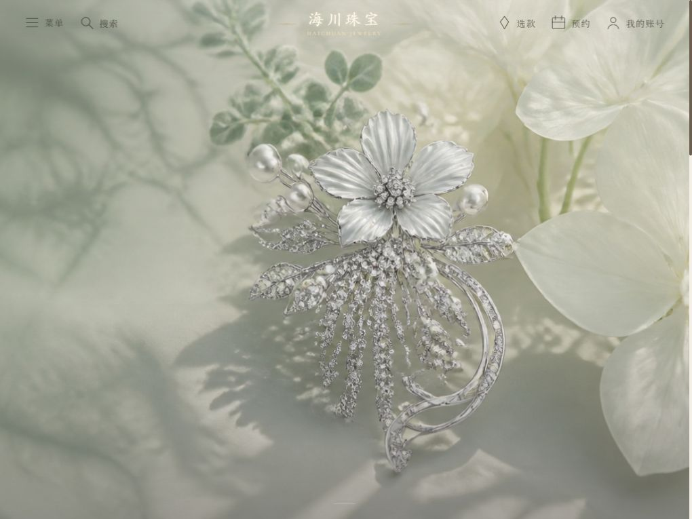
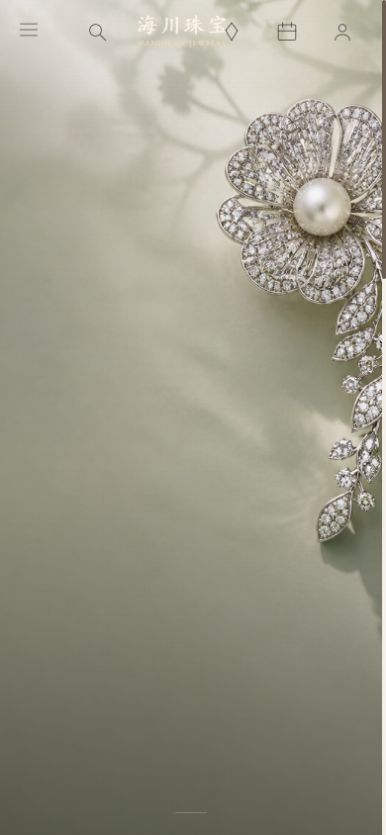
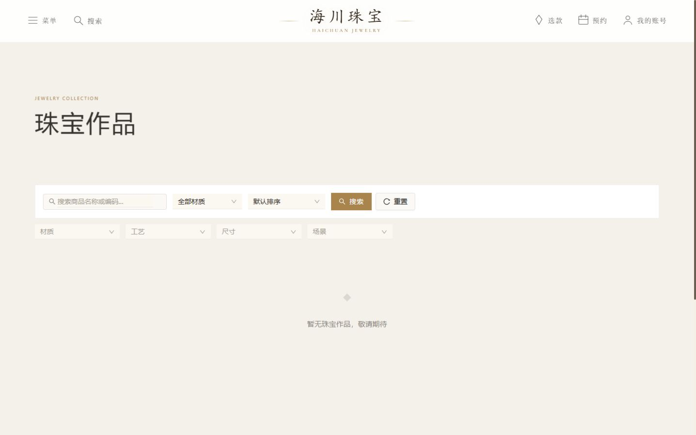
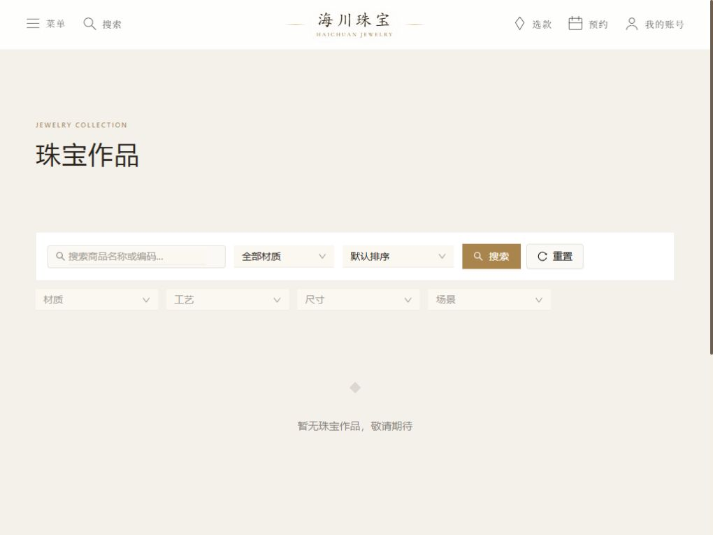
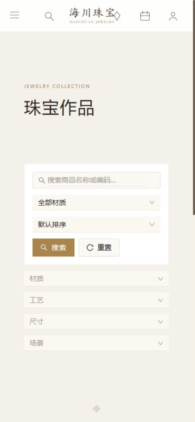
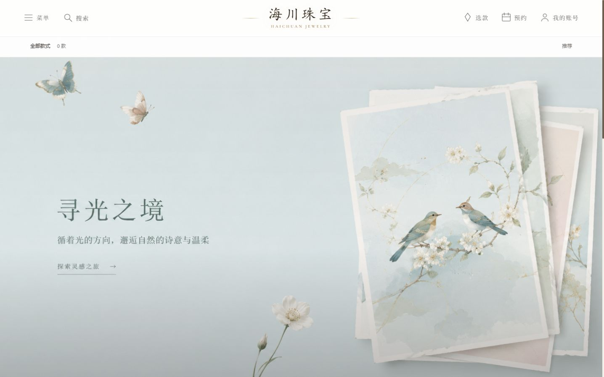
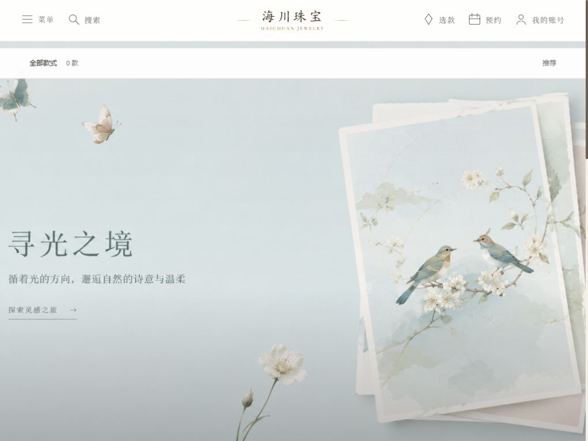
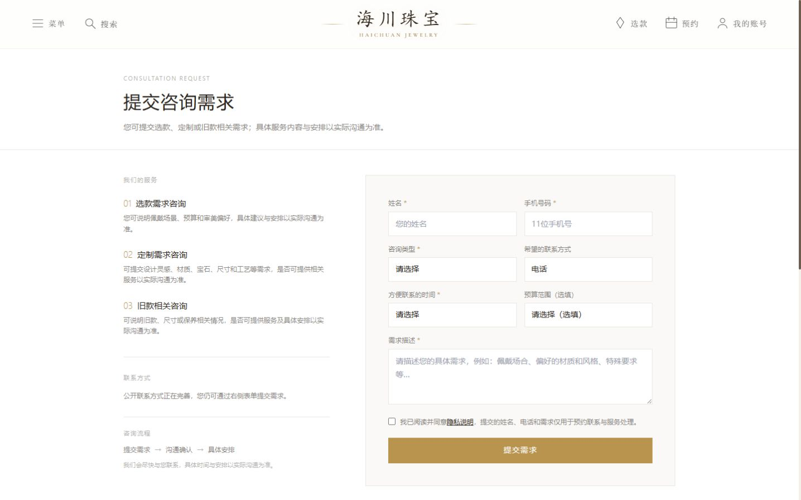
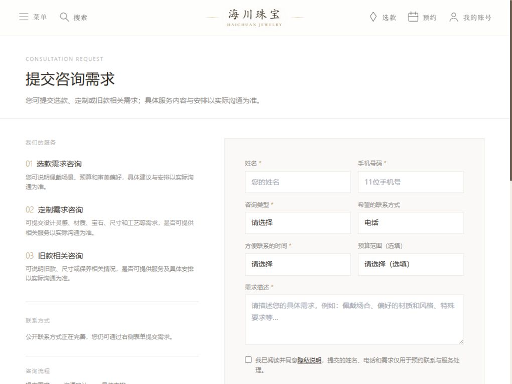
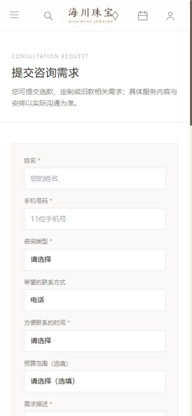

# 海川珠宝前台奢侈品体验基线审计

审计日期：2026-08-17  
审计范围：首页、珠宝作品、选款中心、提交咨询需求；商品详情因无公开商品数据未能进入。  
审计环境：本地前台 `http://localhost:5175`，本地接口 `http://127.0.0.1:3000`。  
断点：桌面 `1440 × 900`、平板 `1024 × 768`、手机 `390 × 844`。

## 结论

当前前台已有较好的图片气质、克制的色彩与基础排版，但核心用户旅程仍未达到可公开发布的奢侈品品牌官网标准。主要问题不是“还不够精致”，而是首页核心信息不可见、公开出现测试分类、作品数据为空导致浏览与详情链路中断，以及无商品状态仍展示复杂筛选工具。

总体健康度：**不建议以当前状态直接公开发布。**

## 关键旅程

### 1. 发现品牌与作品：首页 — 不健康（P0）

- 优点：主视觉素材具有柔和、克制、自然主义的珠宝摄影方向；桌面、平板、手机均未出现横向溢出。
- 确定性故障：首屏标题“自然成诗”与 CTA“探索作品”在三个断点均为 `opacity: 0`。
- 技术证据：元素内联动画引用 `fadeUp`，但当前可访问样式表中没有对应 `@keyframes fadeUp`；动画无法把元素从初始透明状态推进到可见状态。
- 品牌影响：用户只能看到图片，无法理解品牌主张，也没有清晰的首屏行动入口；这会直接破坏品牌叙事和转化。
- 风险：浅色主视觉上的白色标识与导航在局部区域对比偏弱，需在修复文案后做真实图片上的对比度复核。

| 桌面 | 平板 | 手机 |
| --- | --- | --- |
|  |  |  |

### 2. 浏览珠宝作品：作品列表 — 不健康（P0/P1）

- 优点：页面标题清晰，错误、加载和空状态代码路径存在；三个断点均无横向溢出。
- 当前公开接口返回 `total: 0`、`listCount: 0`，用户无法完成任何作品浏览。
- 在零商品状态下仍先展示搜索、材质、排序、工艺、尺寸、场景等完整筛选器，尤其手机端形成明显的工具堆叠；信息结构更像后台或普通电商模板，不像奢侈品品牌的策展式浏览。
- 空状态仅写“暂无珠宝作品，敬请期待”，缺少可继续完成任务的明确入口；现有“选款中心”入口又只在有商品时渲染。
- 当前 `ProductList/index.tsx` 存在用户未提交改动，本次审计未修改该文件。

| 桌面 | 平板 | 手机 |
| --- | --- | --- |
|  |  |  |

### 3. 通过选款中心收窄范围 — 不健康（P0/P1）

- 优点：视觉素材留白充分，色调安静；空数据时提供“预约咨询”作为安全降级方向。
- 公开页面出现分类“【试导入】”，属于明确的测试/运营脏数据，不应出现在品牌前台。
- 标题“选款中心”同样受缺失 `fadeUp` 关键帧影响，计算样式为 `opacity: 0`。
- 首屏大片以花鸟与纸张为主，缺少珠宝主体；在商品为零时，这张图进一步弱化“选款”任务。
- 手机首屏仅能看到“0 款”“推荐”和大幅装饰图，用户无法快速理解下一步。
- 大片中的“寻光之境”等重要文字疑似烘焙进图片，DOM 中没有对应等价文本；这是响应式与可访问性风险，需在设计调整时改为真实文本层。

| 桌面 | 平板 | 手机 |
| --- | --- | --- |
|  |  |  |

### 4. 理解单件作品：商品详情 — 阻断（P0）

- 当前公开商品接口返回空列表，没有可用的公开商品 ID。
- 因此本次没有猜测商品 ID、没有绕过权限，也没有伪造详情页成功。
- 详情页的图片浏览、材质信息、询价入口、响应式和错误状态均未完成真实浏览器验收。

### 5. 发起咨询：提交咨询需求 — 基本可用但未达发布标准（P1）

- 优点：服务范围、隐私说明和“以实际沟通为准”的表达较克制，没有制造未经确认的经营承诺；表单字段结构完整，桌面与手机均无横向溢出。
- 桌面端左右结构清晰，但边框、输入框和选择器仍偏通用组件感；手机端表单很长，首屏之后连续堆叠字段，缺少分组节奏。
- 多处浅灰正文与占位文字对比偏弱，存在可读性风险。
- “公开联系方式正在完善”会削弱高客单价咨询所需的信任感；上线前应替换为经过确认的联系方式，或改写为不暴露筹备状态的正式服务说明。
- 本次未提交表单，因此未验证隐私勾选错误反馈、真实提交成功、服务端失败和重复提交状态；不能据此声称咨询链路已通过。

| 桌面 | 平板 | 手机 |
| --- | --- | --- |
|  |  |  |

## 优先级建议

### P0：先恢复核心旅程

1. 修复 `HeroSection` 的 `fadeUp` 动画：补齐关键帧，并提供无动画/减少动态效果时的可见兜底；验证首页与选款中心三个断点。
2. 清理公开分类“【试导入】”：应从公开数据或发布状态上处理，不建议在前端用名称硬编码隐藏。
3. 明确零商品上线策略：在真实商品未确认前，隐藏搜索和复杂筛选，改为正式的策展式空状态与预约咨询入口；有经确认商品后再恢复完整浏览链路。
4. 准备至少一件经过确认的公开作品，以完成“列表 → 详情 → 咨询”的真实验收；不得用 Mock 或猜测 ID 代替。

### P1：建立奢侈品级信息与交互层级

1. 将作品页从“筛选器优先”调整为“系列/作品优先”，筛选作为有库存时的辅助工具；手机端采用渐进披露。
2. 让选款中心首屏明确展示珠宝主体、任务说明和唯一主行动，避免大幅装饰图占据零商品状态的首屏。
3. 统一前台控件的字体、边框、间距、焦点和状态语言，降低 Ant Design 默认外观。
4. 优化咨询表单分组、正文对比度和正式信任信息，并完成失败、隐私校验、重复提交与成功反馈验收。

### P2：品牌系统精修

1. 对真实主视觉逐屏检查标识、导航、标题与图片的局部对比度。
2. 把图片内的重要文字改为 HTML 文本层，保证响应式、可访问性和内容可维护性。
3. 建立首页、列表、详情、咨询之间统一的标题尺度、CTA 语法、留白节奏和图片裁切规则。

## 验证记录与边界

- 已完成：4 个公开页面、3 个断点的当前运行截图；横向溢出检查；首页/选款中心标题计算样式检查；公开商品接口空数据复核；浏览器控制台警告与错误检查（本次检查未发现警告或错误）。
- 未完成：商品详情（无公开商品）；真实表单提交；生产环境、真实数据库、授权边界、历史发布内容；完整键盘焦点顺序；完整 WCAG 合规审计。
- 本次仅新增审计截图与本文档，没有修改业务代码、数据、依赖、环境变量或 Git 状态。

## 推荐的最小实施批次

下一批只做 P0，不进行全站重设计：修复首屏可见性、确定测试分类的公开清理方式、建立零商品安全状态，并在存在一件经确认公开作品后完成列表到咨询的闭环验收。完成这些后，再进入视觉系统与咨询体验的 P1 精修。
